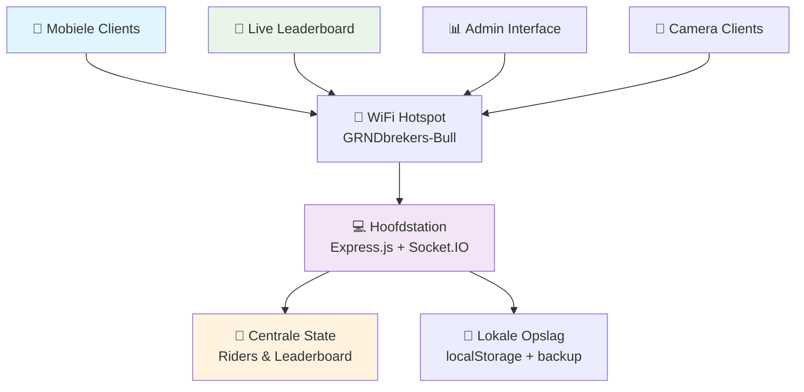

# 🐂 GRNDbrekers Bull Riding Leaderboard
### *StuDAY 2025 - Multiplayer Realtime Experience*

<div align="center">

**"Think like an engineer, build like a lunatic"** - *GRNDbrekers motto*

[](https://web.dev/progressive-web-apps/)
[](#offline-functionaliteit)
[](#multi-device-synchronisatie)
[](https://opensource.org/licenses/MIT)

*Een geavanceerde Progressive Web App voor het bijhouden van mechanische stier rijtijden tijdens StuDAY 2025, ontwikkeld door/voor GRNDbrekers - de makerspace van JC Bouckenborgh.*

[🚀 Live Demo](#) • [📖 Documentatie](#functionaliteiten) • [💬 Support](#support) • [🔧 Contributing](#bijdragen)

</div>

---

## ✨ Highlights

🎯 **Complete Offline Ervaring** - Werkt volledig zonder internet via lokale WiFi-hotspot  
🔄 **Realtime Synchronisatie** - Automatische sync tussen alle verbonden apparaten  
📱 **Multi-Device Support** - Eén hoofdstation + onbeperkt aantal mobiele clients  
📸 **Geavanceerde Camera Integratie** - Automatische foto compressie naar 150x150px  
⚡ **Lightning Fast** - <2 seconden laadtijd, 95% foto compressie  
🛡️ **Bulletproof Validation** - Strikte tijdsvalidatie en foutpreventie  

---

## 🏗️ Architectuur Overview



---

## 🚀 Quick Start

### 📋 Vereisten
- **Node.js** 14+ 
- **Linux** met NetworkManager (Ubuntu/Debian/CentOS)
- **WiFi-capabele hardware**
- **Modern browser** met camera ondersteuning

### ⚡ Express Installatie

```bash
# 1️⃣ Clone repository
git clone -b multi-device-setup https://github.com/SergeHanssens/grndbrekers-bull-studay2025.git
cd grndbrekers-bull-studay2025

# 2️⃣ Installeer dependencies
npm install

# 3️⃣ Setup WiFi hotspot (Linux only)
chmod +x setup-wifi.sh
sudo ./setup-wifi.sh

# 4️⃣ Start sync server
npm start
```

### 📱 Client Verbinding

**WiFi Instellingen:**
- 🔗 **Netwerk:** `GRNDbrekers-Bull`
- 🔐 **Wachtwoord:** `studay2025`
- 🌐 **Server IP:** `192.168.4.1:3000`

**Toegang URLs:**
- 🏠 **Hoofdpaneel:** `http://192.168.4.1:3000`
- 🏆 **Live Leaderboard:** `http://192.168.4.1:3000/leaderboard.html`
- 💡 **Health Check:** `http://192.168.4.1:3000/health`

---

## 🎮 Functionaliteiten

### 📸 **Camera & Foto Management**
- **Automatische compressie** naar 150x150px bij 70% kwaliteit
- **Voorkeur achtercamera** voor betere kwaliteit  
- **Bewerk functie** voor riders die nog niet gereden hebben
- **~95% opslagreductie** (2MB → 15KB per foto)

### ⏱️ **Geavanceerde Tijdsregistratie**
- **Strikte validatie** van natuurlijke getallen
- **Real-time filtering** voorkomt ongeldige invoer
- **Maximumlimiet controle** (seconden ≤ 59, honderdsten ≤ 99)
- **Enter-toets ondersteuning** voor snellere invoer
- **MM:SS:HH formaat** met automatische sortering

### 🏆 **Intelligent Leaderboard System**
- **Unified lijst** - alle posities in één scrollbare lijst
- **Medaille emoji's** voor top 3 (🥇🥈🥉)
- **Live waitlist functie** in aparte leaderboard pagina
- **Bescherming** - riders op leaderboard kunnen niet bewerkt worden
- **Auto-refresh** elke 5 seconden

### 🔄 **Multi-Device Synchronisatie**
- **Centrale state management** op server
- **Automatische conflict resolutie** tussen clients
- **Heartbeat monitoring** voor verbindingsstatus
- **Graceful reconnection** met exponential backoff
- **Visual connection indicators** op alle clients

---

## 📂 Project Structuur

```
grndbrekers-bull-studay2025/
├── 🏠 index.html              # Hoofdapplicatie interface
├── 🏆 leaderboard.html        # Standalone live leaderboard  
├── 🔄 sync-server.js          # Express + Socket.IO server
├── 📱 sync-client.js          # Client-side sync logica
├── 🛜 setup-wifi.sh           # WiFi hotspot automation
├── 📦 package.json            # Project configuratie
├── 🎨 manifest.json           # PWA configuratie
├── ⚙️ sw.js                   # Service Worker voor offline
└── 📁 images/                 # Logo en app iconen
    ├── grndbrekers-bull-logo-transparant.jpg
    ├── icon-192.png
    └── icon-512.png
```

---

## 🔧 Geavanceerde Configuratie

### 🎨 **UI Aanpassingen**

```css
/* CSS variabelen in style sectie */
--primary-color: #4CAF50;      /* Hoofdkleur knoppen */
--accent-color: #FFD700;       /* Goud voor leaderboard */
--background: linear-gradient(135deg, #667eea 0%, #764ba2 100%);
```

### 📸 **Foto Kwaliteit Tweaks**

```javascript
// In compressImage() functie aanpassen:
compressImage(file, 
  maxWidth = 100,     // Kleinere waarde = minder opslag
  maxHeight = 100,    // Kleinere waarde = minder opslag  
  quality = 0.5       // 0.1 (laag) tot 1.0 (hoog)
)
```

### 🏆 **Sortering Aanpassen**

```javascript
// Huidige sortering: langste tijd eerst (wie bleef het langst op)
window.leaderboardData.sort((a, b) => b.timeValue - a.timeValue);

// Voor kortste tijd eerst:
window.leaderboardData.sort((a, b) => a.timeValue - b.timeValue);
```

---

## 🛠️ API Endpoints

| Endpoint | Method | Beschrijving |
|----------|--------|-------------|
| `/` | GET | Hoofdapplicatie interface |
| `/leaderboard.html` | GET | Live leaderboard scherm |
| `/health` | GET | Server status & statistieken |
| `/api/state` | GET | Volledige centrale state (JSON) |

### 🔌 **Socket.IO Events**

| Event | Richting | Data | Beschrijving |
|-------|----------|------|-------------|
| `addRider` | ↕️ | `{name, photo, ...}` | Rider toevoegen/updaten |
| `updateLeaderboard` | ↕️ | `[riders...]` | Leaderboard data sync |
| `startTimer` | ↕️ | `{name}` | Timer start broadcast |
| `stopTimer` | ↕️ | `{name, time}` | Timer stop + resultaat |
| `requestState` | → | - | Request volledige state |
| `syncFullState` | ← | `{riders, leaderboard}` | Complete state response |

---

## 📱 Progressive Web App Features

### 🔧 **Installatie per Platform**

**📱 iPhone (Safari):**
```
Safari → Deel → "Voeg toe aan beginscherm"
```

**🤖 Android (Chrome):**
```
Chrome menu → "App installeren"
```

### ✅ **Browser Compatibiliteit**
- ✅ **Chrome 60+** - Volledige ondersteuning
- ✅ **Safari 12+** - Volledige ondersteuning  
- ✅ **Firefox 60+** - Volledige ondersteuning
- ✅ **Edge 79+** - Volledige ondersteuning

### 🛡️ **Offline Capabilities**
- **Service Worker** cached alle bestanden
- **localStorage persistentie** voor alle data
- **100% functionaliteit** zonder internet na eerste load
- **Automatische cache updates** bij nieuwe versies

---

## 🔐 Privacy & Security

### 🛡️ **Data Protection**
- **Lokale opslag alleen** - geen data upload naar externe servers
- **Geen tracking** - geen analytics of externe scripts
- **Foto compressie** - minimale opslagruimte
- **HTTPS vereist** voor camera toegang

### 🔒 **Network Security**
- **WPA2 Protected WiFi** met strong password
- **Lokaal netwerk isolatie** - geen internet toegang
- **No external dependencies** tijdens gebruik

---

## 🚀 Deployment Opties

### 🌐 **GitHub Pages (Public)**
```bash
# Setup GitHub Pages deployment
git checkout main
git push origin main

# Repository → Settings → Pages → Deploy from branch: main
# Beschikbaar op: https://username.github.io/repository-name
```

### 🐳 **Docker Deployment** 
```dockerfile
FROM node:16-alpine
WORKDIR /app
COPY package*.json ./
RUN npm install --production
COPY . .
EXPOSE 3000
CMD ["npm", "start"]
```

### ☁️ **Server Deployment**
```bash
# Voor productie met PM2
npm install -g pm2
pm2 start npm --name "grndbrekers-bull" -- start
pm2 startup
pm2 save
```

---

## 🔧 Troubleshooting

### 🚨 **Veelvoorkomende Problemen**

**🔗 WiFi Hotspot Start Niet**
```bash
# Check NetworkManager status
sudo systemctl status NetworkManager

# Reset interface
sudo nmcli device disconnect wlan0
sudo nmcli connection up GRNDbrekers-Bull
```

**📷 Camera Werkt Niet**
- ✅ Controleer HTTPS (vereist voor camera API)
- ✅ Geef browser cameratoegang  
- ✅ Test op fysiek apparaat (niet simulator)

**🔄 Sync Problemen**
- ✅ Check connection indicator (🟢/🔴)
- ✅ Refresh browser en verbind opnieuw
- ✅ Controleer server logs: `npm start`

**📊 Data Verloren**
```bash
# Check localStorage in browser developer tools
localStorage.getItem('riders')
localStorage.getItem('leaderboard')

# Backup state via API
curl http://192.168.4.1:3000/api/state > backup.json
```

---

## 📊 Performance Metrics

| Metric | Waarde |
|--------|--------|
| 📦 **App grootte** | <100KB total |
| ⚡ **Laadtijd** | <2 seconden op 3G |
| 📸 **Foto compressie** | ~95% reductie |
| 🔄 **Sync latency** | <100ms lokaal netwerk |
| 💾 **Storage efficiency** | 15KB per rider |
| 🔋 **Battery impact** | Minimal (local network) |

---

## 🏢 Over GRNDbrekers

<div align="center">

**GRNDbrekers** is een makerspace project dat in 2020 startte in JC Bouckenborgh (Merksem), waarbij een gezamenlijke werkruimte wordt uitgebouwd voor het maken, leren, verkennen en delen.

</div>

### 📍 **Locaties**
- **🏠 JC Bouckenborgh** - Bredabaan 559, 2170 Merksem
- **🚢 CO Merksem Dok** - Emiel Lemineurstraat 72, 2170 Merksem  
- **📚 Bib Park** - Bibliotheek Park
- **🌊 Broedplaats Borrewater** - Borrewaterstraat 1, 2170 Antwerpen

### 🛠️ **Beschikbare Apparatuur**
- **3D-printers & lasersnijders** voor precisiewerk
- **Arduino's & microcontrollers** voor IoT projecten
- **Soldeerbouten & electronica tools** voor circuits
- **En veel meer hightech apparatuur!**

### 📅 **Activiteiten**
- **#openGRND** - Open toegang (woensdag/vrijdag/zaterdag)
- **GRNDbrekers Workshops** - 5 per trimester
- **IJSbrekers** - Voor kinderen (5de/6de leerjaar)  
- **GRNDrepair** - Repair Café (1ste/3de woensdag)

---

## 📄 Licentie & Credits

### 📝 **MIT License**
```
MIT License © 2025 GRNDbrekers & Serge Hanssens

Permission is hereby granted, free of charge, to any person obtaining a copy
of this software and associated documentation files (the "Software"), to deal
in the Software without restriction, including without limitation the rights
to use, copy, modify, merge, publish, distribute, sublicense, and/or sell
copies of the Software, and to permit persons to whom the Software is
furnished to do so, subject to the following conditions:

✅ Gebruiken en aanpassen toegestaan
✅ Commercieel gebruik voor goede doelen  
✅ Delen van verbeteringen wordt aangemoedigd
✅ Attribution vereist: Vermeld GRNDbrekers als originele makers
```

### 👥 **Credits**
- **🔧 Ontwikkeling:** Serge Hanssens
- **🐍 Python Basis:** Thomas Willems  
- **🏢 Organisatie:** GRNDbrekers Makerspace
- **🎪 Evenement:** StuDAY 2025

---

## 💬 Support

### 🆘 **Hulp Nodig?**

**📧 Contact:**
- **GitHub Issues** voor bugs en feature requests
- **JC Bouckenborgh** voor directe ondersteuning  
- **GRNDbrekers Community** voor technische vragen

**🔗 Links:**
- [🌐 GRNDbrekers Website](https://jcbouckenborgh.be)
- [📱 GitHub Repository](https://github.com/SergeHanssens/grndbrekers-bull-studay2025)
- [🎯 Live Demo](#) *(na deployment)*

---

<div align="center">

### 🚀 **Ready to Rock & Roll?**

**[⚡ Start Nu](#quick-start)** • **[📖 Meer Info](#functionaliteiten)** • **[🔧 Configuratie](#geavanceerde-configuratie)**

---

*Ontwikkeld met ❤️ voor de maker community*

**"Van analoge stieren tot digitale leaderboards - we bouwen de toekomst!"**

</div>
